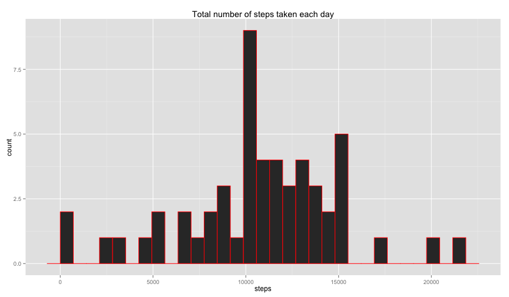
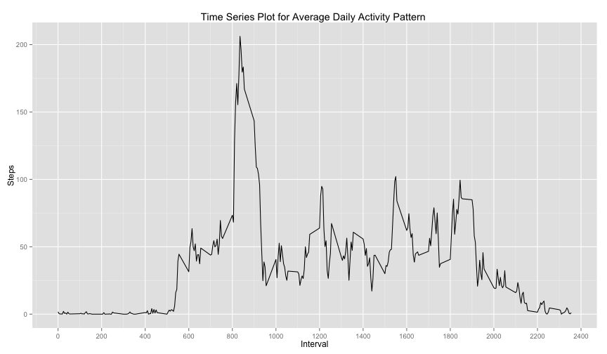
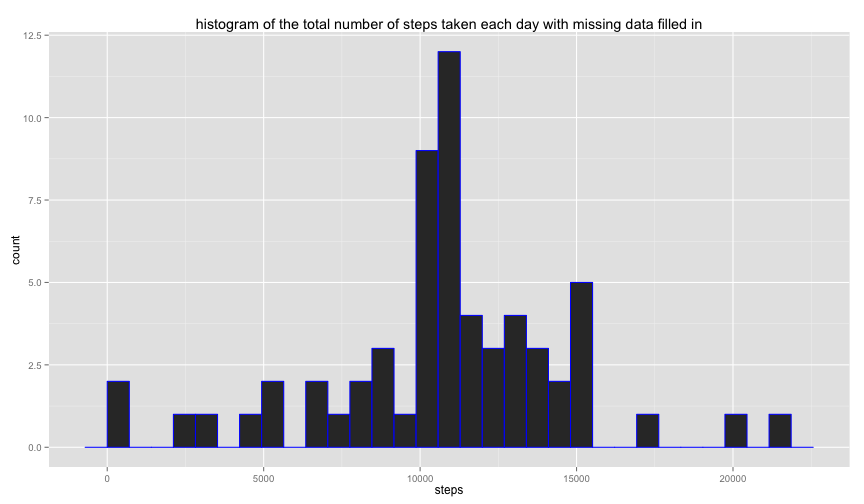
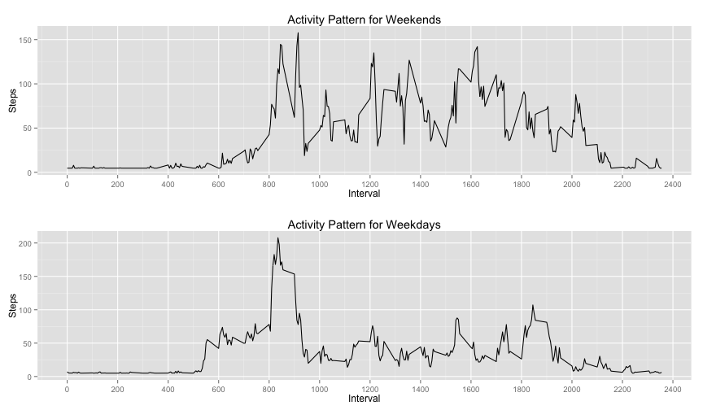

 
#### 1. Mean total number of steps taken per day

Clean data by omitting rows with missing data

```r
# Loading and preprocessing the data
setwd("/Users/venkata/Downloads/coursera/Reproducible Research/Week 2/Assignment")
mydata<-read.csv("activity.csv")
cleandata<-mydata
mydata<-na.omit(mydata)
```

1. Making a histogram of the total number of steps taken each day

```r
# 1. Make a histogram of the total number of steps taken each day
totalsbydate<-aggregate(mydata$steps, by=list(date=mydata$date), FUN=sum)

#rename columns 
colnames(totalsbydate) <- c("date","steps")
# head(totalsbydate)

library(ggplot2)
# histogram of the total number of steps taken each day 
ggplot(totalsbydate, aes(x=steps)) + geom_histogram(color="red")+ggtitle("Total number of steps taken each day")
```

```
## stat_bin: binwidth defaulted to range/30. Use 'binwidth = x' to adjust this.
```

 

2. Calculate and report the mean and median total number of steps taken per day

```r
# 2. Calculate and report the mean and median total number of steps taken per day
# Mean
meanStepsPerDay<- mean(totalsbydate$steps)
paste(" Mean number of steps taken per day : " , meanStepsPerDay)
```

```
## [1] " Mean number of steps taken per day :  10766.1886792453"
```

```r
# Median
medianStepsPerDay<- median(totalsbydate$steps)
paste(" Median number of steps taken per day : " ,  medianStepsPerDay)
```

```
## [1] " Median number of steps taken per day :  10765"
```

#### 2. Average Daily Activity Pattern

1. Time series plot 

```r
# Steps averaged per interval
avgbyinterval<-aggregate(mydata$steps, by=list(interval=mydata$interval), FUN=mean)

#rename columns 
colnames(avgbyinterval) <- c("interval","steps")

# Time Series Plot for Average Daily Activity Pattern 
ggplot(avgbyinterval, aes(interval, steps)) + geom_line() +
 xlab("Interval") + ylab("Steps") + scale_x_continuous(breaks=c(seq(0,2400,by=200)))+ggtitle("Time Series Plot for Average Daily Activity Pattern ")
```

 

2. 5-minute interval, on average across all the days in the dataset, containing the maximum number of steps

```r
maxSteps<-avgbyinterval[which.max(avgbyinterval$steps),]
paste(" maximum number of steps " , maxSteps$steps)
```

```
## [1] " maximum number of steps  206.169811320755"
```

```r
paste(" five minute interval corresponding to maximum number of steps " , maxSteps$interval)
```

```
## [1] " five minute interval corresponding to maximum number of steps  835"
```


#### 3. Imputing Missing Values 

1. Missing values in the dataset

```r
# Report total number of missing values in the dataset
baddata<-cleandata[is.na(cleandata$steps),]
nrow(baddata)
```

```
## [1] 2304
```

2. Missing data filled in using meanStepsPerDay calculated in the previous step. I use the simple 
approach of dividing that into 5 minute intervals per day.

```r
# using mean steps created in the previous block 
cleandata_new <- cleandata
cleandata_new[is.na(cleandata_new$steps), ]$steps <- (meanStepsPerDay/288)  # Average per 5min 
# head(cleandata_new)

# compute totals for date
totalsbydatefornewdata<-aggregate(cleandata_new$steps, by=list(date=cleandata_new$date), FUN=sum)

#rename columns 
colnames(totalsbydatefornewdata) <- c("date","steps")

# plot histogram for data set with missing values filled in 
ggplot(totalsbydatefornewdata, aes(x=steps)) + geom_histogram(color="blue") + ggtitle("histogram of the total number of steps taken each day with missing data filled in")
```

```
## stat_bin: binwidth defaulted to range/30. Use 'binwidth = x' to adjust this.
```

 

4. Mean, Median calculation using the new data set 

```r
# Mean
meanWithMissingData <- mean(totalsbydatefornewdata$steps)
paste(" mean with missing data filled in " , meanWithMissingData)
```

```
## [1] " mean with missing data filled in  10766.1886792453"
```

```r
# Median
medianWithMissingData  <- median(totalsbydatefornewdata$steps)
paste(" median with missing data filled in " , medianWithMissingData)
```

```
## [1] " median with missing data filled in  10766.1886792453"
```

```r
# Difference in mean/median between missing data removed
# and missing data filled in 
paste("Difference in Median is ", medianWithMissingData-medianStepsPerDay )
```

```
## [1] "Difference in Median is  1.1886792452824"
```

```r
paste("Difference in Mean is ", meanWithMissingData-meanStepsPerDay )
```

```
## [1] "Difference in Mean is  0"
```
Since the difference between mean, median is negligible between the two data samples, we can say 
that adding in missing data doesnot make much of a difference. 

#### 4. Activity patterns between weekdays and weekends

```r
cleandata_new$isWeekday <- as.factor(ifelse(weekdays(as.Date(cleandata_new$date)) %in% c("Saturday", "Sunday"), "Weekends", "Weekday"))

# head(cleandata_new)

# filter out Weekend data
weekdaydata <- cleandata_new[(cleandata_new$isWeekday=="Weekday"),]
# head(weekdaydata)

# Compute average across Weekdays
meanstepbydateforfactoreddata<-aggregate(weekdaydata$steps, by=list(interval=weekdaydata$interval), FUN=mean)

#rename columns 
colnames(meanstepbydateforfactoreddata) <- c("interval","steps")
# head(meanstepbydateforfactoreddata)

weekdayplot<-ggplot(meanstepbydateforfactoreddata, aes(interval, steps)) + geom_line() +
 xlab("Interval") + ylab("Steps") + scale_x_continuous(breaks=c(seq(0,2400,by=200)))+ggtitle("Activity Pattern for Weekdays")


# filter out Weekday data
weekenddata <- cleandata_new[(cleandata_new$isWeekday=="Weekends"),]
# head(weekenddata)

# Compute average across Weekends
meanstepbydateforfactoreddata<-aggregate(weekenddata$steps, by=list(interval=weekenddata$interval), FUN=mean)

#rename columns 
colnames(meanstepbydateforfactoreddata) <- c("interval","steps")
# head(meanstepbydateforfactoreddata)

weekendplot<-ggplot(meanstepbydateforfactoreddata, aes(interval, steps)) + geom_line() +
 xlab("Interval") + ylab("Steps") + scale_x_continuous(breaks=c(seq(0,2400,by=200)))+ggtitle("Activity Pattern for Weekends")

# multiplot function from  Winston Chang's R cookbook
multiplot <- function(..., plotlist=NULL, cols) {
    require(grid)

    # Make a list from the ... arguments and plotlist
    plots <- c(list(...), plotlist)

    numPlots = length(plots)

    # Make the panel
    plotCols = cols                          # Number of columns of plots
    plotRows = ceiling(numPlots/plotCols) # Number of rows needed, calculated from # of cols

    # Set up the page
    grid.newpage()
    pushViewport(viewport(layout = grid.layout(plotRows, plotCols)))
    vplayout <- function(x, y)
        viewport(layout.pos.row = x, layout.pos.col = y)

    # Make each plot, in the correct location
    for (i in 1:numPlots) {
        curRow = ceiling(i/plotCols)
        curCol = (i-1) %% plotCols + 1
        print(plots[[i]], vp = vplayout(curRow, curCol ))
    }

}

multiplot(weekendplot,weekdayplot,cols=1)
```

```
## Loading required package: grid
```

 


